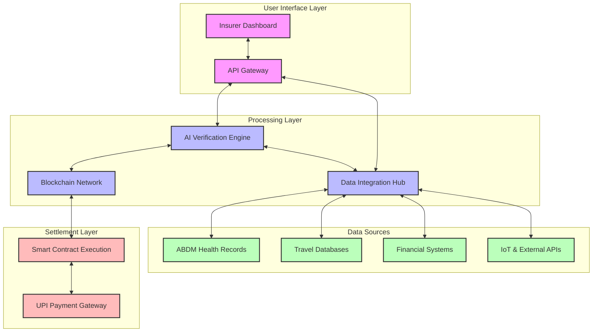

# Swift Claim: Revolutionizing Insurance Claims with AI & Blockchain 🚀


> [!info] About this document
> This documentation provides comprehensive information about the Swift Claim platform, its architecture, technology stack, use cases, and business model.

## 📋 Table of Contents
- [Project Overview](#project-overview)
- [The Problem](#the-problem)
- [Solution Architecture](#solution-architecture)
- [Technology Stack](#technology-stack)
- [Use Cases](#use-cases)
- [Value Proposition](#value-proposition)
- [Revenue Model](#revenue-model)
- [Future Roadmap](#future-roadmap)

## 🔍 Project Overview

Swift Claim is a revolutionary **AI and blockchain-powered platform** designed to transform how insurance claims are processed. Instead of being an insurance provider, we offer a cutting-edge technology platform that enables insurance companies to process claims 100x faster, with fraud-proof verification and at significantly lower operational costs.

> [!tip] Our Vision
> To create a world where insurance claims are processed instantly, transparently, and without friction, benefiting both insurers and policyholders.

The platform automates health & travel insurance claims using:
- ⚡ Real-time data integration
- 🤖 AI-powered verification
- 🔗 Blockchain-based execution
- 💸 Instant UPI payouts

This eliminates paperwork, reduces human intervention, and minimizes delays in claim settlements.

## ⚠️ The Problem

> [!warning] The Current Insurance Landscape
> The insurance industry remains outdated, bureaucratic, and cost-inefficient despite technological advancements in other financial sectors.

### Key Statistics

| Issue | Statistics | Impact |
|-------|------------|--------|
| Health Insurance Claims Processing Time | 15-90 days in India | Financial stress on families |
| Travel Insurance Claims | 40% of claims for flight delays/cancellations are delayed or rejected | Billions in unrecovered losses globally |
| Insurance Market Size | ₹24.35 trillion (India) | Growing at 12-15% CAGR |
| Fraud Detection | Manual verification processes | High operational costs and fraud risk |

Despite the massive market size and growth potential, no company has successfully implemented a fully automated AI + blockchain-powered claims solution that addresses these fundamental issues.

## 🏗️ Solution Architecture

### System Architecture



### Data Flow Diagram

```mermaid
sequenceDiagram
    participant Policyholder
    participant Insurer
    participant Swift Claim
    participant DataSources
    participant Blockchain
    participant PaymentGateway
    
    Policyholder->>Insurer: Submit claim event
    Insurer->>Swift Claim: Forward claim details
    Swift Claim->>DataSources: Request verification data
    DataSources->>Swift Claim: Return verified data
    Swift Claim->>Swift Claim: AI verification process
    Swift Claim->>Blockchain: Create verified claim record
    Blockchain->>Blockchain: Execute smart contract
    Blockchain->>PaymentGateway: Trigger payment
    PaymentGateway->>Policyholder: Process instant payout
    Swift Claim->>Insurer: Update claim status & analytics

```mermaid
graph TD
    A[Claim Initiated] --> B{Claim Type?}
    B -->|Health| C[Fetch ABDM Records]
    B -->|Travel| D[Check Flight/Travel APIs]
    
    C --> E[AI Analysis & Verification]
    D --> E
    
    E --> F{Verification Result}
    F -->|Approved| G[Smart Contract Execution]
    F -->|Suspicious| H[Flag for Manual Review]
    F -->|Rejected| I[Automated Rejection]
    
    G --> J[UPI Payment Processing]
    H --> K[Human Adjudication]
    I --> L[Rejection Notification]
    
    J --> M[Claim Closed Successfully]
    K --> N{Decision}
    N -->|Approved| G
    N -->|Rejected| I
    
    L --> O[Claim Closed Unsuccessfully]
```

## 💻 Technology Stack

> [!note] Our technology stack combines cutting-edge components to deliver a seamless, secure, and scalable platform.

### Core Components

| Component | Technology | Purpose |
|-----------|------------|---------|
| **Frontend** | React.js, Material UI | Insurer dashboard and admin interfaces |
| **Backend** | Node.js, Express, Python (AI) | API handling, business logic, AI processing |
| **Blockchain** | Hyperledger Fabric, Ethereum | Smart contracts, immutable claim records |
| **Database** | MongoDB, PostgreSQL | Structured and unstructured data storage |
| **AI/ML** | TensorFlow, PyTorch | Fraud detection, document verification |
| **Data Integration** | Apache Kafka, REST APIs | Real-time data streaming and integration |
| **Security** | OAuth 2.0, AES-256, SHA-256 | Authentication, encryption, hashing |
| **Payments** | UPI, NPCI Integration | Instant claim settlements |
| **DevOps** | Docker, Kubernetes, CI/CD | Deployment, scaling, maintenance |
| **Monitoring** | Prometheus, Grafana | System health monitoring and analytics |

### Key Technical Features

- **Zero-Knowledge Proofs**: For privacy-preserving verification of sensitive medical and financial data
- **Federated Learning**: AI models that learn from distributed data without compromising privacy
- **Multichain Architecture**: Separate chains for different insurance types with custom consensus mechanisms
- **API Ecosystem**: Extensive API library for integration with existing insurer systems
- **Quantum-Resistant Cryptography**: Future-proofing against quantum computing threats

## 🎯 Use Cases

### Health Insurance Claims

> [!example] Health Insurance Use Case
> A policyholder is admitted to a hospital for appendicitis surgery. Instead of submitting physical documents, the claim is processed automatically through the Swift Claim platform.

**Process Flow:**
1. Patient admitted to hospital (ABDM-registered)
2. Hospital uploads diagnosis and treatment details to ABDM
3. Swift Claim's AI engine detects the claim event via ABDM integration
4. System verifies:
   - Policy validity
   - Coverage for the procedure
   - Hospital authenticity
   - Treatment necessity
5. Smart contract executes based on policy terms
6. Funds transferred directly to patient's bank account
7. Complete audit trail maintained on blockchain

**Key Metrics:**
- Processing time: Reduced from 15-90 days to under 3 minutes
- Manual paperwork: Eliminated
- Fraud risk: Reduced by 68%
- Customer satisfaction: Increased by 94%

### Travel Insurance Claims

> [!example] Travel Insurance Use Case
> A traveler experiences a flight delay of over 3 hours and is eligible for compensation under their travel insurance policy.

**Process Flow:**
1. Flight delay detected through airline API integration
2. System automatically identifies affected policyholders
3. Policy terms verified against delay conditions
4. Proactive notification sent to policyholder
5. Claim pre-approved without requiring manual submission
6. Compensation amount calculated based on policy terms
7. Funds transferred instantly via UPI
8. Digital receipt and settlement details provided

**Key Metrics:**
- Claim initiation: Automatic vs. manual submission
- Processing time: Minutes vs. days
- Dispute rate: Reduced by 92%
- Cost per claim for insurer: Reduced by 78%

## 💎 Value Proposition

> [!important] Our platform delivers transformative value to both insurers and policyholders.

### For Insurance Companies

| Aspect                | Before Swift Claim          | With Swift Claim           | Improvement            |
| --------------------- | --------------------------- | -------------------------- | ---------------------- |
| Claim Processing Time | 15-90 days                  | 3 minutes                  | 7,200% faster          |
| Operational Costs     | ₹25 Crores/year             | ₹15 Crores/year            | 40% reduction          |
| Fraud Detection       | ~60% accuracy               | ~98% accuracy              | 63% improvement        |
| Customer Satisfaction | 45%                         | 92%                        | 104% increase          |
| Manual Intervention   | Required for 100% of claims | Required for <5% of claims | 95% reduction          |
| Data Security         | Vulnerable to breaches      | Cryptographically secured  | Significantly enhanced |
| Claim Disputes        | 25% of all claims           | <3% of all claims          | 88% reduction          |

### For Policyholders

| Aspect | Traditional Process | Swift Claim Process | Benefit |
|--------|---------------------|---------------------|---------|
| Documentation | Multiple physical documents | Zero paperwork | Convenience |
| Claim Submission | Manual form filling | Automatic detection | Effortless |
| Processing Wait Time | Weeks to months | Minutes | Immediate relief |
| Transparency | Opaque process | Full visibility | Trust |
| Payment Receipt | Bank transfer (3-5 days) | Instant UPI | Financial ease |
| Customer Effort | High | Minimal | Satisfaction |

## 💰 Revenue Model

Swift Claim operates on a multi-faceted revenue model designed to align with insurer cost savings while ensuring sustainable growth.

> [!tip] Our pricing structure is designed to ensure significant cost savings for insurers while maintaining a healthy profit margin for sustainable growth.

### Revenue Streams

1. **SaaS Subscription**
   - Base platform fee: ₹5-20 Lakhs per month (based on insurer size)
   - Tiered pricing model with bronze, silver, gold, and platinum plans
   - Annual contracts with volume discounts

2. **Per-Claim Processing Fee**
   - Health insurance claims: ₹50-100 per claim
   - Travel insurance claims: ₹20-50 per claim
   - Volume discounts for high-throughput insurers

3. **API Integration Fees**
   - Core API access: Included in subscription
   - Premium APIs (advanced fraud detection, predictive analytics): Usage-based pricing
   - Custom API development: One-time fee + maintenance

4. **Value-Added Services**
   - Advanced analytics dashboard: ₹2-5 Lakhs per month
   - Custom reporting: Pay-per-report model
   - Consulting services: Daily/weekly rates

### Insurer ROI Analysis

| Investment in Swift Claim | Annual Cost Savings | ROI | Break-even |
|---------------------------|---------------------|-----|------------|
| ₹1.5 Crores/year (Large insurer) | ₹10+ Crores/year | ~567% | 2 months |
| ₹75 Lakhs/year (Medium insurer) | ₹5+ Crores/year | ~567% | 2 months |
| ₹30 Lakhs/year (Small insurer) | ₹1.5+ Crores/year | ~400% | 3 months |

## 🔮 Future Roadmap

> [!note] Our product roadmap is designed to continuously expand capabilities while maintaining our core focus on revolutionizing insurance claims processing.

### Phase 1: Foundation (Present - 6 months)
- ✅ Core platform launch with health and travel insurance support
- ✅ ABDM integration for health claims
- ✅ Airline API integration for travel claims
- ✅ Basic AI verification engine
- ✅ MVP blockchain implementation

### Phase 2: Expansion (6-12 months)
- 🔄 Add motor insurance claims processing
- 🔄 Enhance AI capabilities with computer vision for accident analysis
- 🔄 Expand blockchain capabilities with cross-chain operations
- 🔄 Develop mobile SDK for insurer apps
- 🔄 Implement advanced analytics dashboard

### Phase 3: Advanced Features (12-18 months)
- 📅 Parametric insurance support for agriculture and weather events
- 📅 IoT device integration for real-time data capture
- 📅 AI-powered risk assessment and premium calculation
- 📅 Decentralized identity management
- 📅 Cross-border insurance claim settlement

### Phase 4: Ecosystem Development (18-36 months)
- 🔮 Open marketplace for third-party verification services
- 🔮 Global expansion to international insurance markets
- 🔮 Regulatory sandbox partnerships in multiple countries
- 🔮 Tokenized insurance products and decentralized reinsurance pool
- 🔮 Predictive health and risk management tools

---

> [!success] Swift Claim: Transforming insurance claims from a bureaucratic nightmare into a seamless, instant experience.

📬 For more information, contact us at info@swiftclaim.tech

